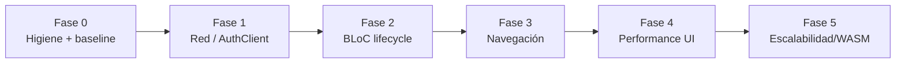

# Análisis Técnico y Plan de Mejoras — Agente Viajes (Admin Panel)

> **Fecha:** 2026-07-21 · **Versión analizada:** 3.0.0+1 · **Alcance:** 243 archivos Dart, ~79.000 líneas, 24 módulos de features.
> **Plataforma principal:** Web (Flutter Web con `usePathUrlStrategy`).

---

## 1. Resumen ejecutivo

La app tiene una base arquitectónica correcta (Clean Architecture por feature, BLoC, GetIt, `AuthClient` centralizado), pero presenta **riesgos de estabilidad reales** y **cuellos de botella de performance** que crecen con cada feature nueva:

| Área | Estado | Riesgo |
|------|--------|--------|
| Ciclo de vida de BLoCs (DI) | 🔴 Crítico | Crashes tipo "Cannot add new events after calling close"; datos de un usuario visibles tras logout |
| Cliente HTTP (`AuthClient`) | 🔴 Crítico | Retry automático de POST en error 500 → **posible duplicación de reservas/pagos**; race condition en refresh de token |
| Navegación / rutas | 🟠 Alto | 23 casts sin validar de `settings.arguments` → al refrescar la página en web, crash silencioso con fallback a ProfileScreen; deep-linking roto |
| Tamaño de widgets | 🟠 Alto | Pantallas de 7.762 / 5.412 / 4.226 líneas; un solo `setState` reconstruye formularios completos (67 `setState` y 46 controllers en un solo State) |
| Paginación | 🟠 Alto | Solo `cotizaciones` pagina; el resto de listas descarga TODO el dataset |
| Tests | 🔴 Crítico | **Cero tests** (el único `widget_test.dart` está comentado) |
| Higiene de código | 🟡 Medio | 263 issues de `flutter analyze` (128 APIs deprecadas, 11 `use_build_context_synchronously`, dead code) |
| Compatibilidad futura | 🟡 Medio | `dart:html` en SSE bloquea compilación WASM; fuentes de Google cargadas en runtime |

**Cifras del escaneo estático:**

- 389 llamadas a `setState` / 196 `TextEditingController` / 68 `dispose()` — desbalance que sugiere controllers sin liberar.
- 76 `jsonDecode` en el isolate principal, 0 usos de `compute()`.
- 0 usos de `.timeout()` en peticiones HTTP.
- 23 casts inseguros `settings.arguments as X` en el router.
- 146 bloques `catch (e)` dispersos sin manejo de errores centralizado.

---

## 2. Análisis detallado

### 2.1 Arquitectura de estado y DI (crítico)

**Problema A — Mezcla inconsistente de `registerFactory` y `registerLazySingleton` para BLoCs** (`lib/core/di/injection_container.dart:197-232`):

- `TourBloc`, `CatalogueBloc`, `FaqBloc`, `ServiceBloc`, `PoliticaReservaBloc`, `PagoRealizadoBloc`, `CotizacionBloc`, `HotelBloc`, `ProveedorBloc`, `NotificacionBloc` son **lazySingleton**.
- El resto son **factory**.

Consecuencias:

1. `BlocProvider` **cierra** (`close()`) el bloc que crea cuando se desmonta. Si ese bloc es un lazySingleton de GetIt, GetIt sigue devolviendo la **instancia cerrada** → `StateError: Cannot add new events after calling close`. Hoy no explota porque los providers viven en el root de `MaterialApp` y nunca se desmontan, pero es una bomba de tiempo: cualquier refactor que mueva un provider la detona.
2. Los singletons **nunca se resetean al hacer logout**: el siguiente usuario que inicie sesión ve el estado (tours, pagos, cotizaciones, notificaciones) del usuario anterior hasta que cada pantalla recargue. Es fuga de datos entre sesiones además de fuga de memoria.

**Problema B — 23 `BlocProvider` en el root** (`lib/main.dart:178-209`):

- Aunque `create` es lazy, todos los BLoCs terminan vivos simultáneamente durante toda la sesión, incluso los de features que el usuario nunca abre.
- `TourBloc` dispara `LoadTours()` al primer acceso (`lib/main.dart:181`), potencialmente **antes de autenticarse** (petición 401 garantizada en frío).

**Problema C — `NotificacionBloc` (singleton) mantiene una conexión SSE** que no se cierra en logout ni se reconecta con backoff; `SseNotificacionService` pasa el token JWT **por query string** (`lib/features/notificaciones/data/services/sse_notificacion_service.dart:21`), lo que lo expone en logs de servidores/proxies.

### 2.2 Cliente HTTP — `AuthClient` (crítico)

`lib/core/network/auth_client.dart`:

1. **Retry ciego en 500** (líneas 44-48): reintenta *cualquier* request, incluidos POST no idempotentes. Si el backend procesó la petición pero respondió 500 (timeout de gateway, error post-commit), se **duplica la reserva/pago/cotización**. Este es el hallazgo más grave del análisis.
2. **Race condition en refresh de token** (líneas 51-92): N peticiones concurrentes que reciben 401 lanzan N llamadas a `/refresh` en paralelo. Si el backend rota el refresh token (un solo uso), la primera gana y las demás invalidan la sesión → logouts aleatorios bajo carga. Falta un lock/`Completer` compartido.
3. **`MultipartRequest` no se clona** (línea 36): un upload que reciba 401 no se reintenta tras el refresh; simplemente falla.
4. **Sin timeouts**: 0 usos de `.timeout()` en todo `lib/`. Una petición colgada congela el spinner para siempre.
5. Token leído de `FlutterSecureStorage` en **cada** request (línea 18); en web es localStorage (barato), pero en móvil añade latencia IPC por petición — cachear en memoria e invalidar en refresh/logout.
6. **Manejo de errores no centralizado**: 146 `catch (e)` repartidos por repos y pantallas, cada uno con su propio formato de mensaje. No hay una jerarquía `ApiException`/`NetworkException`/`ValidationException` común.

### 2.3 Navegación y rutas (alto)

`lib/config/app_router.dart` + `lib/core/layout/admin_shell_wrapper.dart`:

1. **23 casts sin validar** (`settings.arguments as Tour`, etc.). En web con `usePathUrlStrategy`, al **refrescar la página** (F5) o compartir la URL de `/tours/edit`, `arguments` llega `null` → el cast lanza → el `try/catch` de `onGenerateNestedRoute` (línea 163) lo traga y muestra... `ProfileScreen`. El usuario refresca un formulario y aparece en su perfil sin explicación.
2. **Deep-linking roto por diseño**: las rutas de detalle/edición dependen de objetos pasados por memoria, no de IDs en la URL. `/tours/edit` no codifica *qué* tour. La URL con path strategy es cosmética.
3. **Ruta desconocida → `ProfileScreen`** (línea 365): no hay pantalla 404; los errores de routing se silencian.
4. **Doble fuente de verdad para la ruta actual**: `AppRouter.currentRouteNotifier` (global, `app_router.dart:143`) y `_currentRoute` en `AdminShellWrapper` (con `setState` diferido en `addPostFrameCallback`). Es frágil y ya requiere workarounds.
5. `pushReplacementNamed` en el navigator anidado destruye la pantalla anterior en cada cambio de sección: se pierde scroll, filtros y estado, y se re-descarga la lista completa (agravado por la falta de paginación).
6. La transición custom `_fadeRoute` (fade+scale de 280 ms) se aplica a **todas** las rutas, incluidas pantallas pesadas; en web low-end suma jank al primer frame de pantallas grandes.

### 2.4 Widgets y rendering (alto)

1. **God-widgets**: `reserva_form_screen.dart` (7.762 líneas, 67 `setState`, 46 controllers), `respuesta_cotizacion_form_screen.dart` (5.412), `tour_form_screen.dart` (4.226), `pago_realizado_form_screen.dart` (3.140). Cada `setState` reconstruye el árbol entero del formulario: teclear en un campo con listeners puede reconstruir miles de widgets.
2. **196 `TextEditingController` vs 68 `dispose()`**: alta probabilidad de controllers/focus nodes sin liberar (verificar caso por caso en Fase 4).
3. `shrinkWrap: true` en 9 listas anidadas: fuerza layout completo de los hijos, anulando la virtualización.
4. `Image.network` (13 usos) sin `cacheWidth`/`cacheHeight` ni `errorBuilder` consistente: en listas con imágenes de tours se decodifican imágenes a resolución completa.
5. 76 `jsonDecode` en el isolate de UI sin `compute()`: en respuestas grandes (listas sin paginar) el parseo bloquea el frame. Nota: en web `compute` no usa isolates reales, pero el problema de fondo (respuestas enormes) se resuelve con paginación (2.5).

### 2.5 Datos y paginación (alto)

Solo `api_cotizacion_repository.dart` y `api_respuesta_cotizacion_repository.dart` usan `page`/`limit`. **Reservas, tours, clientes, pagos, hoteles, proveedores, auditoría** descargan la colección completa en cada visita a la lista. Esto:

- crece linealmente con los datos del negocio (hoy funciona, en 2 años no),
- multiplica el costo del `jsonDecode` en UI,
- y se repite en cada `pushReplacementNamed` porque la pantalla se destruye (2.3.5).

### 2.6 Web específico

`web/index.html`:

- **PDF.js desde CDN** (cdnjs): si el CDN falla o hay bloqueadores, la impresión de manifiestos/reservas muere en producción. Debe servirse como asset local.
- `@import` de Google Fonts en CSS (render-blocking) **y además** `GoogleFonts.interTextTheme()` en runtime (`app_theme.dart:10`): doble descarga de Inter. Bundlear la fuente como asset y `GoogleFonts.config.allowRuntimeFetching = false`.
- `user-scalable=no` en viewport: problema de accesibilidad.
- `dart:html` en `sse_notificacion_service.dart`: API deprecada; **bloquea la compilación a WASM** (el futuro de Flutter Web y una mejora de performance directa). Migrar a `package:web` + `dart:js_interop` (ya tienen `web: ^1.1.0` en pubspec).

### 2.7 Calidad y tooling

- **263 issues** de `flutter analyze`: 128 `deprecated_member_use` (`withOpacity`, `activeColor`, `RadioListTile.value`…), 11 `use_build_context_synchronously` (bugs potenciales reales de contexto tras `await`), 30 `dead_null_aware_expression`, 6 `dead_code`.
- **Cero tests**: `test/widget_test.dart` está 100% comentado. No hay red de seguridad para ninguna de las fases siguientes — por eso el plan empieza creando la base de tests de lo crítico *antes* de refactorizar.
- `analysis_options.yaml` usa solo los lints por defecto.
- Archivos sueltos en el root (`refactor.dart`, `replace_ip.dart`, `sd.md`) que ensucian el análisis y el repo.
- `CLAUDE.md` documenta 12 features; existen 24.

---

## 3. Plan de mejoras por fases

Principio del plan: **primero estabilidad (lo que puede corromper datos o crashear), después performance, después escalabilidad**. Cada fase deja la app deployable y termina con su propia verificación. Los tests se escriben **antes o junto con** cada refactor, nunca después.

### Fase 0 — Línea base, higiene y tooling (1-2 días)

Objetivo: poder medir el impacto de todo lo demás y detener la regresión de calidad.

**Tareas**

1. Capturar métricas base: `flutter build web --release` (tamaño de bundle), Lighthouse sobre el build, DevTools timeline del dashboard y de la lista de reservas, tiempo de arranque en frío.
2. Corregir los 263 issues del analyzer (la mayoría son mecánicos: `withOpacity`→`withValues`, borrar dead code, prefijos). Prioridad a los 11 `use_build_context_synchronously`, que son bugs latentes.
3. Endurecer `analysis_options.yaml`: activar `prefer_const_constructors`, `prefer_const_literals_to_create_immutables`, `unawaited_futures`, `cancel_subscriptions`, `close_sinks`, `avoid_print` como error.
4. Eliminar/mover `refactor.dart`, `replace_ip.dart`, `sd.md` fuera del análisis (carpeta `tool/` o borrar).
5. CI mínimo (GitHub Actions): `flutter analyze --fatal-infos` + `flutter test` + build web en cada PR.
6. Actualizar `CLAUDE.md` con los 24 módulos reales.

**Pruebas / criterio de salida**

- `flutter analyze` → 0 issues, y el CI lo garantiza en adelante.
- Documento con métricas base (bundle KB, TTI, frames del dashboard) contra el cual medir Fases 4-5.

---

### Fase 1 — Estabilidad de red: `AuthClient` y manejo de errores (3-4 días)

Objetivo: eliminar el riesgo de duplicación de operaciones y los logouts aleatorios.

**Tareas**

1. **Retry en 500 solo para métodos idempotentes** (GET/HEAD). Para POST/PUT/PATCH/DELETE: no reintentar nunca automáticamente; si el backend lo soporta, introducir header `Idempotency-Key` en operaciones de creación de reservas/pagos.
2. **Serializar el refresh de token**: un `Completer<String?>` compartido — el primer 401 dispara el refresh, los demás esperan el resultado. Cubrir rotación de refresh token.
3. **Clonar `MultipartRequest`** para que los uploads también sobrevivan al ciclo 401→refresh→retry.
4. **Timeouts**: `connectionTimeout`/`.timeout(30s)` global en `AuthClient.send`, con excepción tipada `NetworkTimeoutException`.
5. **Cachear el access token en memoria** (invalidar en refresh/login/logout) para evitar la lectura de storage por request.
6. **Jerarquía de errores centralizada** en `core/network/`: `ApiException` (status, mensaje del backend, código), `NetworkException`, `SessionExpiredException`. Un helper `handleResponse<T>(response, parser)` que usen todos los repos — elimina progresivamente los 146 `catch (e)` ad-hoc (migración completa de repos se termina en Fase 2/4).

**Pruebas (unit tests — primeros tests reales del proyecto)**

- `test/core/network/auth_client_test.dart` con `MockClient` de `package:http/testing.dart`:
  - GET con 500 → reintenta una vez; POST con 500 → **no** reintenta.
  - 401 → refresh → retry con token nuevo; refresh fallido → limpia storage y notifica `SessionExpiredNotifier`.
  - 3 peticiones concurrentes con 401 → **una sola** llamada a `/refresh`.
  - Multipart con 401 → se reintenta correctamente.
  - Timeout → lanza `NetworkTimeoutException`.
- Tests de `handleResponse` para cada categoría de status code.

**Criterio de salida:** suite de red en verde en CI; verificación manual de login/expiración/upload en la app corriendo.

---

### Fase 2 — Ciclo de vida de BLoCs y sesión (3-4 días)

Objetivo: estado predecible, sin fugas entre sesiones ni singletons cerrados.

**Tareas**

1. **Todos los BLoCs a `registerFactory`** salvo los 2-3 genuinamente globales (`AuthBloc` — que pasa a singleton explícito con ciclo controlado —, `ThemeCubit`, `NotificacionBloc`). Documentar la regla en CLAUDE.md: *"BLoC = factory; singleton solo con justificación de ciclo de vida"*.
2. **Sacar del root los ~18 providers de feature** y proveerlos **por ruta** en `app_router.dart` (patrón que ya usan `saldos_pendientes` y `auditoria`: `BlocProvider(create: (_) => sl<XBloc>()..add(LoadX()))`). El root queda con: `ThemeCubit`, `AuthBloc`, `NotificacionBloc`.
3. Eliminar `TourBloc..add(LoadTours())` del arranque; la carga se dispara al entrar a la ruta.
4. **Logout limpio**: en `LogoutRequested`, desconectar SSE, y como los BLoCs de feature ahora son factories por ruta, el `pushNamedAndRemoveUntil` al login los destruye — verificar que ningún estado sobrevive.
5. SSE: reconexión con backoff exponencial en `onError`, y mover el token de query string a cookie/header si el backend lo permite (coordinar con backend; si no, documentar el riesgo).

**Pruebas**

- `bloc_test` para `AuthBloc` (login OK, login fallido, AppStarted con/sin sesión, logout) y para 2-3 BLoCs representativos (`TourBloc`, `ReservaBloc`) con repositorios mock (`mocktail`).
- Widget test de humo: montar la app con auth mockeado → login → dashboard → logout → login screen, verificando que se recrean los BLoCs (GetIt factory) y no queda estado previo.
- Test de DI: `initDependencies()` + `sl.allReadySync()`; verificación de que resolver dos veces un factory da instancias distintas.

**Criterio de salida:** logout/login consecutivos sin datos residuales; ningún `StateError` de bloc cerrado en una sesión completa de QA manual por las 24 secciones.

---

### Fase 3 — Navegación robusta y deep-linking (4-5 días)

Objetivo: URLs reales, refresh de página que no rompe, cero casts inseguros.

**Tareas**

1. **Rutas por ID, no por objeto**: `/tours/edit` → `/tours/:id/edit`. La pantalla recibe el ID, lo busca en el BLoC (o hace fetch si no está). El objeto por `arguments` queda solo como *optimización* opcional de precarga, nunca como requisito.
2. **Helper de argumentos seguro**: `T? argOf<T>(RouteSettings s)` que devuelve null en vez de lanzar; toda ruta con argumento inválido/nulo redirige a su pantalla de lista (no a ProfileScreen).
3. **Pantalla 404** para rutas desconocidas + logging del error de routing (quitar el fallback silencioso a `ProfileScreen` en `onGenerateNestedRoute`).
4. **Unificar el estado de ruta actual**: eliminar `AppRouter.currentRouteNotifier` global; el `NavigatorObserver` del shell es la única fuente.
5. **Evaluar `go_router`** para el shell + rutas anidadas (`ShellRoute`): resuelve path params, deep-linking, guards de auth y 404 de forma declarativa. Decisión al inicio de la fase: si se adopta, las tareas 1-4 se implementan sobre go_router; si no, se implementan sobre el router actual. *Recomendación: adoptarlo — el router manual de 397 líneas ya duplica lo que go_router da gratis, y es la base de escalabilidad de rutas.*
6. Guard de autenticación por redirect (con go_router: `redirect`), en lugar del `BlocListener` + `addPostFrameCallback` actual del wrapper.
7. Transición ligera (fade simple y más corta) para pantallas pesadas de formulario.

**Pruebas**

- Widget tests de router: navegar a cada ruta nombrada y verificar la pantalla montada (tabla ruta→widget); ruta con argumento ausente → lista correspondiente; ruta inexistente → 404.
- Test de deep-link: montar la app con `initialRoute: '/tours/123/edit'` y sesión mockeada → verifica que carga el tour 123 por fetch.
- Test del guard: ruta protegida sin sesión → login.
- Manual en web: F5 en formulario de edición, URL compartida en pestaña nueva, botones atrás/adelante del navegador.

**Criterio de salida:** refrescar cualquier URL de la app la restaura correctamente; 0 casts `as` sin guard en el router.

---

### Fase 4 — Performance de UI y datos (5-8 días, incremental)

Objetivo: formularios fluidos, listas que escalan, arranque más rápido. Se hace **por pantalla, en orden de impacto**: reservas → cotizaciones → tours → pagos.

**Tareas**

1. **Descomponer los god-widgets**: `reserva_form_screen.dart` (7.7k líneas) se divide en secciones-widget (`DatosClienteSection`, `PasajerosSection`, `PagosSection`…) cada una `StatefulWidget` propio o manejada por el BLoC del formulario. Regla objetivo: ningún archivo de presentación > 800 líneas, ningún `build` > 150 líneas. Un `setState` de un campo solo reconstruye su sección.
2. **Auditar disposal**: cuadrar los 196 `TextEditingController` con sus `dispose()`; los formularios divididos facilitan esto. Activar los lints `cancel_subscriptions`/`close_sinks` (ya en Fase 0) como verificación.
3. **Paginación de servidor** en reservas, clientes, pagos, tours históricos y auditoría (patrón ya existente en cotizaciones: `page`/`limit` + scroll infinito o paginador). Requiere coordinar con el backend si algún endpoint no lo soporta.
4. Eliminar los 9 `shrinkWrap: true` anidados usando `CustomScrollView`/`SliverList`.
5. `Image.network` → wrapper `AppNetworkImage` con `cacheWidth` acorde al layout, `errorBuilder` y placeholder shimmer reutilizando el existente.
6. **Fuentes**: bundlear Inter como asset (`google_fonts` con `allowRuntimeFetching=false`), quitar el `@import` duplicado de `index.html`.
7. **PDF.js local**: servirlo desde `web/` como asset propio en vez de cdnjs.
8. `const` agresivo tras activar los lints (gran parte lo resuelve `dart fix --apply`).
9. Generación de PDFs (`reserva_pdf_generator`, `bus_manifiesto_pdf_generator`): mover el armado del documento fuera del frame (async por chunks) y mostrar progreso — hoy congela la UI en manifiestos grandes.

**Pruebas**

- **Widget tests por sección de formulario extraída** (el corazón de la fase): render con datos iniciales, validación, y callback de guardado — escribirlos *al extraer cada sección* garantiza que el refactor no cambia comportamiento. Objetivo: las 4 pantallas grandes cubiertas por secciones.
- Unit tests de mappers/entidades (`fromJson`/`toJson`) de reservas, tours y pagos — protegen la paginación y cualquier cambio de contrato.
- Widget test de lista paginada: scroll al final → dispara `LoadMore` → renderiza página 2.
- Perfilado antes/después con DevTools (rebuild counts en formulario de reservas; frames > 16 ms en listas) y comparación contra la línea base de Fase 0. Lighthouse del build release.

**Criterio de salida:** teclear en el formulario de reservas no reconstruye la pantalla completa (verificable con "Track widget rebuilds"); listas principales paginadas; bundle web sin fuentes/PDF.js remotos.

---

### Fase 5 — Escalabilidad y compatibilidad futura (3-5 días + continuo)

Objetivo: que la feature #25 cueste menos que la #24 y la app esté lista para el runtime WASM.

**Tareas**

1. **Migrar `dart:html` → `package:web` + `dart:js_interop`** (SSE service y cualquier otro uso). Verificar con `flutter build web --wasm`.
2. **Plantilla de feature** (`tool/` script o doc): estructura domain/data/presentation, repo con `handleResponse`, BLoC factory, ruta con ID, tests mínimos obligatorios. Reduce la divergencia que hoy existe entre features viejas y nuevas.
3. **Divergencia de listas/formularios**: extraer a `core/widgets/` los patrones repetidos (tabla/lista con búsqueda + shimmer + empty state; scaffold de formulario con guardado) que hoy están copiados en 20+ pantallas.
4. CI completo: analyze + tests con `--coverage` y umbral mínimo (empezar en el % real alcanzado, subirlo por PR), build web, y build `--wasm` como job informativo.
5. Actualización de dependencias mayor pendiente (`fl_chart 0.69` está varias majors atrás; revisar breaking changes) — hacerlo aquí, con la suite de tests ya existente como red.
6. Documentación viva: CLAUDE.md actualizado con las reglas de las fases (BLoC factory, rutas por ID, límites de tamaño de archivo, patrón de errores).

**Pruebas**

- La suite completa de Fases 1-4 en verde sobre el build WASM y el build JS.
- Golden tests opcionales de los widgets compartidos de `core/widgets/` (lista, form scaffold, empty states) para blindar el design system.
- Smoke test E2E (integration_test) del flujo crítico de negocio: login → crear cotización → responder → crear reserva → registrar pago → PDF. Es el test más valioso de todo el plan; se hace al final porque necesita la navegación por IDs de la Fase 3.

**Criterio de salida:** `flutter build web --wasm` compila y pasa smoke test; crear una feature nueva siguiendo la plantilla toma < 1 día.

---

## 4. Orden y dependencias

- **Fases 0-2 son secuenciales y no negociables**: tocan riesgo de datos (duplicación de pagos, fuga entre sesiones).
- Fase 4 puede solaparse con Fase 3 (son pantallas vs. router).
- Estimación total: **4-6 semanas** de un desarrollador senior a tiempo completo, entregando valor deployable al final de cada fase.

## 5. Quick wins (se pueden hacer hoy, < 1 hora cada uno)

1. Quitar el retry de 500 para métodos no-GET en `auth_client.dart:44` (elimina el riesgo de pagos duplicados **ya**).
2. Añadir `.timeout(const Duration(seconds: 30))` en `AuthClient.send`.
3. Quitar `..add(LoadTours())` de `main.dart:181`.
4. `dart fix --apply` + pasada manual → gran parte de los 263 issues.
5. Copiar `pdf.min.js`/`pdf.worker.min.js` a `web/` y referenciarlos localmente.
6. Borrar `refactor.dart`, `replace_ip.dart` y `sd.md` del root.
